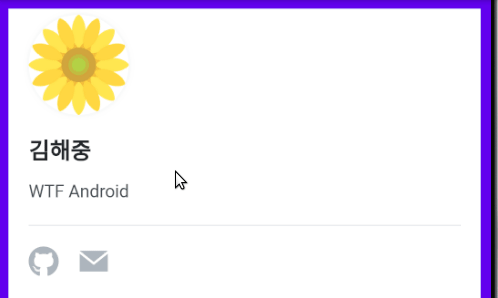
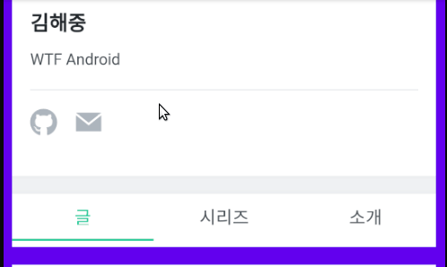
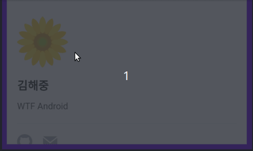
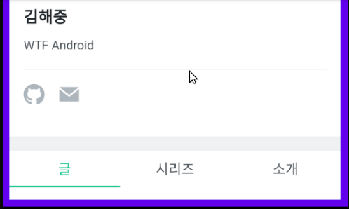

## WebView에 Long Click 및 Highlight 제거하는 방법

> Android 앱을 구성하다 보면 몇몇 컨텐츠(광고, 배너, 이용약관 등)들을 WebView를 사용하여 표시하곤 합니다.
>
> 이런 구성에서 Android의 WebView는 보통 Clipboard와 컨텍스트 메뉴를 표시하기 위해서 Long Click을 이용합니다. 그런과정에서 불필요한 사용자 경험을 고객에게 주게 됩니다. 
>
> 간단하게 WebView를 설정하여 Long Click과 Anchor의 Highlight를 표시하지 않게 하는 방법을 설명합니다.


#### 기본 상태에서의 동작

* WebView내에서 Long Click 이벤트가 텍스트위에서 발생한 경우
  

* WebView내에서 앵커의 Highlight가 표시되는 경우


#### WebView의 설정을 변경하고 CSS를 주입한 경우의 동작

* WebView내에서 아무리 Long Click 이벤트가 발생해도 컨텍스트 메뉴가 표시되지 않습니다.
  
* WebView내에 표시되는 컨텐츠의 앵커를 클릭해도 Highlight가 표시 되지 않습니다.
  


#### 간단하게 코드 살펴보기

```kotlin
class MainActivity : AppCompatActivity() {
    override fun onCreate(savedInstanceState: Bundle?) {
        super.onCreate(savedInstanceState)
        setContentView(R.layout.activity_main)
        setupWebView()
    }

    @SuppressLint("SetJavaScriptEnabled")
    private fun setupWebView() {
        ...
        ...        
        webview_not_long_clickable.run {
            settings.let {
                it.javaScriptEnabled = true
                it.domStorageEnabled = true
            }

            // #1
            setOnLongClickListener { true }
            isLongClickable = false

            webViewClient = object : WebViewClient() {
                override fun onPageFinished(view: WebView?, url: String?) {
                    // #2
                    view?.evaluateJavascript(CSS_BLOCK_HIGHLIGHT, null)
                    super.onPageFinished(view, url)
                }
            }

            loadUrl(URL)
        }
    }

    companion object {
        private const val URL = "https://velog.io/@haejung"
        // #3
        private const val CSS_BLOCK_HIGHLIGHT = """
            javascript:(function() {
                var parent = document.getElementsByTagName('head').item(0);
                var style = document.createElement('style');
                style.type = 'text/css';
                
                style.innerHTML = 'body { -webkit-tap-highlight-color: transparent; };';
                
                parent.appendChild(style)
            })()
        """
    }
}
```


#### 설명

* **#1**

  * `WebView`를 설정하는 과정에서 WebView의 View의 상속으로 가지고 있는 속성인 isLongClickable과 OnLongClickListener를 설정해서 임의로 Long Click Event가 WebView에서 처리되지 않도록 합니다.

* **#2**

  * `WebView`의 컨텐츠가 모두 로드 된 후에 HTML의 Tab Highlight Color를 투명하게 만드는 CSS를 주입합니다.

    ```kotlin
    style.innerHTML = 'body { -webkit-tap-highlight-color: transparent; };';
    ```

    주입되는 CSS에서 body 태그의 tab-highlight-color를 변경합니다.

* **#3**

  * WebView에서는 Javascript와는 다르게 CSS를 직접 주입하는 방법이 없습니다. 우회법으로 #3의 Javascript를 구성하고 evaluation하도록 해서 CSS가 주입되도록 하는 Javascript 코드입니다.
  * Javascript를 evaluation하는 방법은 evaluateJavascript()외에 loadUrl, loadData를 통해서도 가능합니다.


